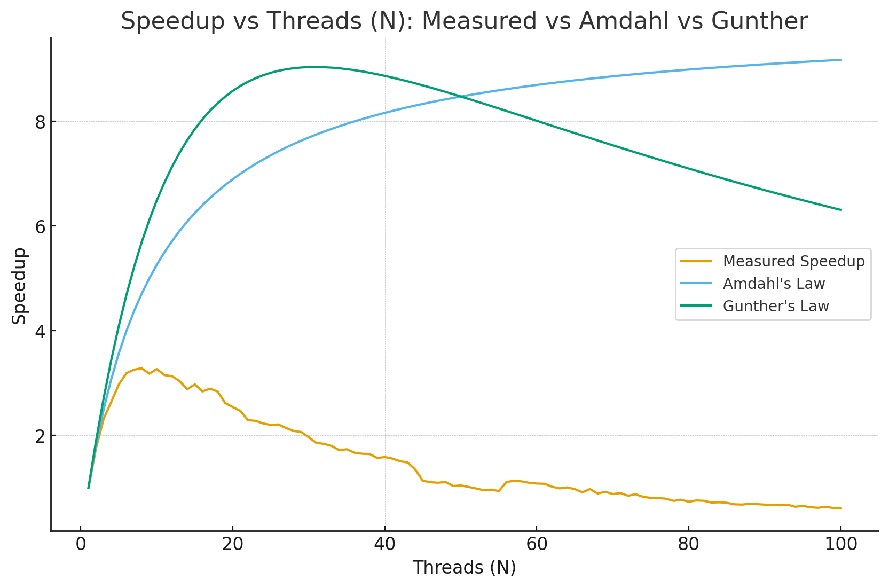

# System Design
System design, architecture, and databases explained from the *Software Architecture & Technology of Large-Scale Systems* Udemy Course and *Designing Data Intensive Applications* book for leveling up your software engineering skills and preparing for interviews

### Key Vocabulary:
* Throughput - # of requests processed/time
* Latency - how long request takes to be handled
    * Combination of wait/idle time for other resources and processing time of your programs
    * Response time is the result of what the client sees including latency + network delay to transport the result to the user
* Idempotence - send same request twice, get same result with no side effects

It's best to organize software into:
* Client - part of backend where the request is handled
* Services - process request
* Resources - databases that services query from

That way the client dosen't have to directly access resources and everything can be independent

## Performance
Performance is defined as the responsiveness of your software under load with the goal of minimizing latency and maximizing throughput

Performance reductions are the result of a queue buildup of requests or jobs caused by:
* Slow processing
* Limited resource capacity
* Synchronous processes that can be made concurrent

To improve latency, you can either:
1. Vertically scale by improving your Hardware (CPU, Network, Memory, Disk size)
2. Caching data frequently read and rarely modified (server has cache controls)

To improve throughput:
1. Improve concurrency mechanisms of concurrent requests/jobs
2. Make serial aspects concurrent to process more requests/jobs simultaneously
    1. Reducing how many lines of code locks cover through lock splitting for objects and lock striping for data structures inside objects
    2. Design around optimistic locking (use a version number column) over pessimistic locking to avoid locking the database

### Latency
Latency acts as a bottleneck for throughput which is why you should improve it first:
* Network:
    * Use compression via binary encoding Protobufs to reduce data size and cache data
    * Reuse application session and database connections
* Memory:
    * Use proper memory allocation techniques to reduce memory leaks, and cache data properly
    * Normalize your data to avoid duplication and wasted space
    * Choose good garbage collectors for cleaning weak/soft references to objects
* Disk:
    * Use indexes to speed queries and denormalize distributed data
    * Use SSDs and RAID configurations for hardware
    * Use zero copy to reduce copying data between memory buffers (from disk straight to network)
* CPU:
    * Use batch and asynchronous processing

Higher throughput means you can support more users greater than the peak

Tail latency is an important metric that measures 99th, 99.9th... response times to model how well your application handles peak load

Amdahl's law models the concurrency speedup by using more threads. After an initial sharp speedup, you will notice diminishing returns of concurrency because of the overhead of managing the threads as well as CPU context switching.

Gunther's law is Amdahl's law by taking into account coherence delay (caching of variables and syncing them across caches) and scaling dimension which is slower to maintain as you add more threads

## Scalability

Horizontal scaling - more of the same machine to handle more load
* Cost grows linearly
* Software has to support multi machine instances and coordinate data between them

Vertical scaling - upgrading hardware
* Cost grows nonlinearly
* Committing to the machine you buy

To scale a system you need:
1. Decentralization - specialized workers
2. Independence - of workers to take advantage of concurrency

Monoliths by definitions are anti-patterns for scalability

Modularity - breaking business logic down into specialized functions/services with loosely coupled modules and decoupled services

To make a system scalable, you have to make it decentralized with independent components:
* Cache frequently read and rarely modified data to reduce load on the backend
* Use asynchronous and event driven processing for distributing load over time
* Vertically patition system into independent, stateless, replicated services
* Shard and replicate data
* Use load balancers to distribute load evenly
    * Discovery service to offload tracking healthy ip addresses away from load balancer 
* DNS as a load balancer at a global scale

Microservices are vertically partitioned services and databases that make your software highly scalable leading to eventual consistency
* Services developed and deployed independently (for each business vertical) with seperate database and schema for each service
    * allow for frequent deployment of new features for users 
* Tradeoff exists between independence and reusability of components as you want seperat eschemas and services for each business vertical and no reusable libraries except utilities to reduce coupling

Microservice distributed transactions:
* Don't reuse libraries except utilities to avoid inter-service dependencies
* Compensating transactions/saga pattern means you rollback entire transaction if any part of it fails
    * Old way is to use transactions with 2 phased commits (2nd phase commits when locks from other transactions done) should hold ACID within services and compensating transactions across services to become eventually consistent. Issue is you need all the services to vote on whether a transaction has permission to commit. Compensating transactions are more used for microservices

* Use synchronous processing for immediate responses and read queries and asynchronous processing for write queries and where deferred responses are okay

Event driven architecture - producers publish event to router/broker/message queue and consumer consumes them
* Producer and consumer services being decoupled allows them to scale, be developed, and deployed independently
* Transactions are done async and the database is polled regularly in case services go down. If transaction part of an event fails, new undo events created to revert changes to the database

Stateful web applications have data and require low latency
Stateless web applications store data in cache leading to higher scalability than stateful at the expense of higher latency
* store session data in caches like Redis such as client side cookies, server shared cache

## Scaling Databases
**A Database is the hardest part of software to scale** because now you have to maintain transaction order and data consistency

Data is either replicated or sharded/partitioned across multiple nodes

Duplicating databases or components in general results in redundancy to increase fault tolerance and availability

### Replication strategies:

* Each of these are usually done asynchronously, as to not slow follower writes to wait for confirmation from followers

1. Leader replication - choose 1 database to be the leader who accepts all writes from client and the rest of the databases are followers that accepts all reads from client
* Increase read throughput
* Increase durability by copying our data
* Leader sends replication logs (Write Ahead Log) of ordered data changes to followers to help them stay synchronized and achieve consistency if follower goes down
* Writes might not reach all followers in time for client read

2. Multi-leader replication - leaders act as followers to other leaders
* Increase write availability (failure of one leader dosen't disrupt writes)
* If one leader fails, promote a follower to new leader and reroute write requests to it with old leader becoming a follower when it comes back
* Have to handle write conflicts with multiple leaders

3. Leaderless replication - use quorum voting among nodes to validate read/write operations
* Balance high availability with data accuracy
* quorum = $W + r \geq n$ where $n$ is the number of nodes, $W$ and $r$ are the write and read quorum as the minimum number of nodes that need to agree for a write or read to be valid

### Database Sharding/Partitioning:
Sharding/partioning is splitting up the data across multiple databases to increase throughput without overloading a single database and is done either:

1. Key Range - give partitions a sorted order of ranges based on key
* Do this if you plan to do a lot of range queries

2. Hashed Key Range - hash key ranges to keep distribution of keys uniform and avoid skew
* Do this if you plan to make a lot of queries based on ids

### Scalability Tools:

Load Balancer - routes requests to avaiable IP addresses of nodes to handle them
* Ex. DNS acts as a load balancer mapping domain name to an IP address

Discovery Service - handles keeping track of healthy node IP addresses seperate from the load balancing

Reverse Proxy - program guide requests from client to server
* Can be type of load balancer that maps requests to server IP addresses
* Handle security, routing, caching

Sticky Sessions - all requests from specific user routed to same server node using cookie from the session id so that you can cache user login info

Message Queue - producers add messages to a queue called the broker that consumers process
* Decouples services as producers don't have to wait for consumer to process messages
* Independently scale producers and consumers
* Handle load spikes by offloading work to be processes asynchronously later to increase peak load

Auto Scaler - creates/deletes new app instances automatically to match load
* Registers new instances with load balancer and registers old ones
* New instances assigned VM/Container image, new IP address
* Configure min/max thresholds on cloud and monitor app health via pinging and http health checks as well as resource monitoring

## Databases
| Relational (SQL) | Document (NoSQL) |
|---|---|
| Support for joins| More flexible schemas and faster reading|
| Better for many:1 or many:many relationships| Better for one:many relationships like in trees |

Graph is better for modeling many:many common and complex relationships with edges as well as storing different object types in verticies

* Index - lookup reference to find rows
* Secondary Index - lookup reference to find rows based on other column values
* Primary Key - uniquely identifies a row
* Foreign Key - points to a row in another table

B-Tree - generalized binary search tree that stores keys and data/pointers to data making them faster for individual key queries
* middle key is made parent when new key is added thats greater than capacity (make sure tree is balanced and all leaf nodes at same depth)

B+ Tree - stores data only in leaf nodes linking them together in a linked list making them faster for range queries

OLTP (Online transaction processing) - fast, real time transactions on small number of records

OLAP (Online analytical processing) - analysis and reporting of the history of all records 

Data warehouse - low latency storage of large volumes of data for analytical processing requiring high availability

Column oriented storage stores values from each column together in seperate files so you only read columns used in query instead of all the values in the row
* More efficient for analytical queries over large datasets

Backward compatible - new code can read data generated by older code 

Forward compatible - older code can read data generated by newer code

Protobuf - serialize objects in binary format with field tags/aliases instead of key/values like in JSON with datatypes clearly specified
* forward compatible when incrementing new field tag for new fiels
* backward compatible as new fields are optional and tags have the same meaning

Avro - encode entire object and refer to schema for types of each field
* reader and writer schema compatability ensures backward compatibility

RPC (remote procedure call) - running code on another computer using a local function call
gRPC - RPC with protobufs for encoding objects and supporting streams

Transaction - group multiple reads and writes into single, logical unit where a commit is made if all parts succeed else abort/rollback to avoid partial failures

Atomicity - all or nothing guarantee making it easy to abort transaction as whole if error happens
Consistency - truth, invariants kept true
Isolation - concurrent transactions seperated and don't interfere
Durability - committed transaction data stays using write ahead log for single nodes or replicated among multiple nodes